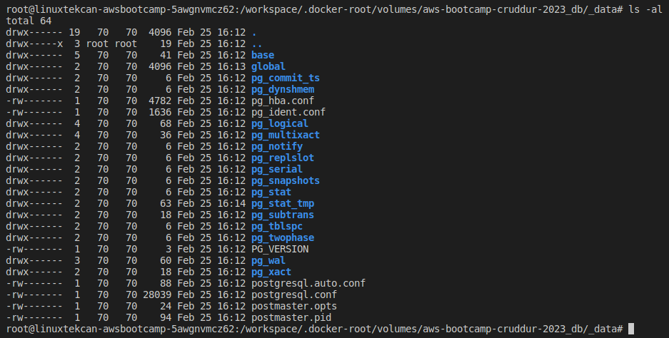
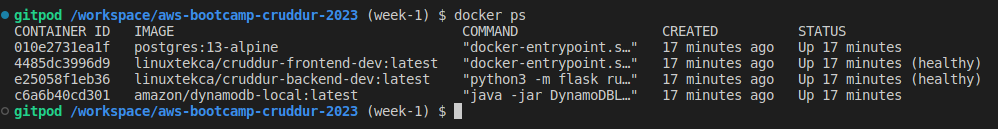
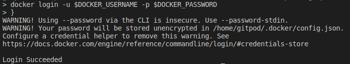
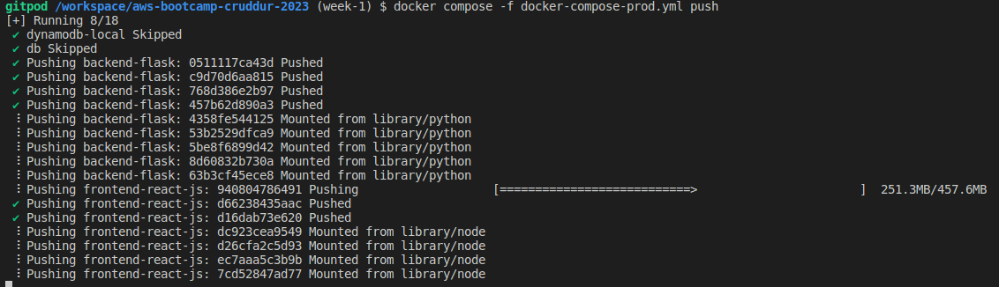
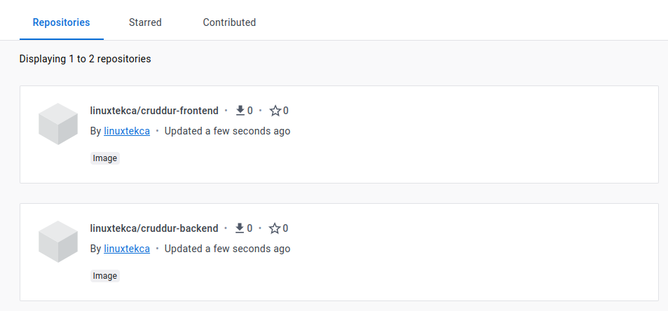
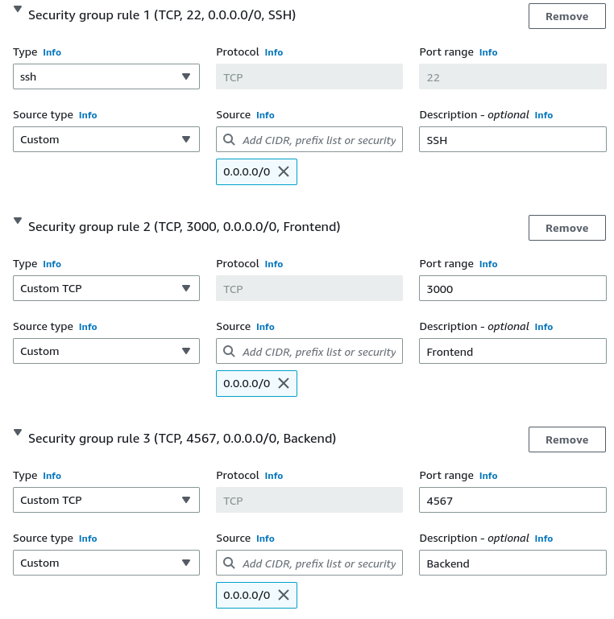
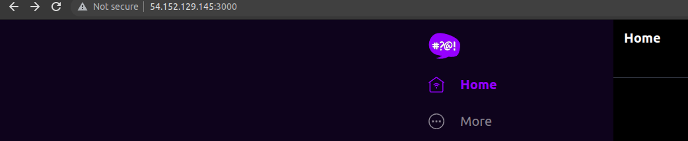
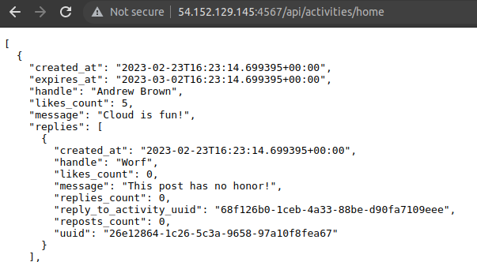

# Week 1 — App Containerization

## Required Homework

### Video Review

* Watched [How to Ask for Technical Help](https://youtu.be/tDPqmwKMP7Y) video.
* Watched [Grading Homework Summaries](https://youtu.be/FKAScachFgk) video.
* Watched [Week 1 Live Streamed Video](https://www.youtube.com/live/zJnNe5Nv4tE?feature=share) during the livestream and followed along with the tasks.
* Watched [Commit Your Code](https://youtu.be/b-idMgFFcpg) video.
* Watched [Chirag's Week 1 Spend Consideration](https://youtu.be/OAMHu1NiYoI) video.
* Watched [Ashish's Week 1 Security Consideration](https://youtu.be/OjZz4D0B-cA) video.
* Watched [Week 1 - Create the notification feature (Backend and Front)](https://youtu.be/k-_o0cCpksk) video.
  * The hardcoded confirmation code when registering an account with Cruddur is '1234'.
  * [OpenAPI Specification v3.1.0](https://spec.openapis.org/oas/v3.1.0)

### Actions

* Completed all steps during the livestream to containerize the application.
  * Reviewed notes and code in [Github - Week 1](https://github.com/omenking/aws-bootcamp-cruddur-2023/blob/week-1/journal/week1.md).
* Went through [video](https://youtu.be/k-_o0cCpksk) steps and added frontend and backend notifications functionality.
  * Documented notification endpoint for OpenAPI document.
  * Wrote Flask backend endpoint for notifications.
  * Wrote React page for notifications. 
* Went through [video](https://youtu.be/CbQNMaa6zTg) steps to set up PostgreSQL and DynamoDB Local
  * Ran DynamoDB Local container to ensure it worked
  * Ran Postgres container to ensure it worked  
  * [AWS Documentation - DynamoDB Local](https://docs.aws.amazon.com/amazondynamodb/latest/developerguide/DynamoDBLocal.DownloadingAndRunning.html)
  * [100 Days of Cloud - DynamoDB Local Challenge](https://github.com/100DaysofCloud/challenge-dynamodb-local)

  * Tested connecting to DynamoDB Local using ```aws dynamodb list-tables --endpoint-url http://localhost:8000``` which returned empty table info successfully.  I intentionally didn't add the Music tables.
 
  

  * Added steps to install PostgreSQL Client into [.gitpod.Dockerfile](../.gitpod.Dockerfile) and tested using ```psql -h localhost -p 5432 -U postgres -d postgres```
 


## Spending Considerations
* Watched video.  Did not have time for additional activities on spend considerations this week.

## Security Considerations
* Watched video.  Did not have time for additional activities on security considerations this week.
* Had seen that npm finds a lot of vulnerabilities, and normally you would want to fix thsees, but upgrading versions of dependencies could break the app.  We had a discussion about this in the Discord.
* One action item for later on is to set up AWS Secrets Manager to store the secrets instead of in Gitpod, once we move more out of local development.

## Stretch Homework

### Added steps to update Gitpod environment (incorrect)

I noticed during the prep phase that NPM complained about being out of date:


From running ```lsb_release -a``` I also found we are running Ubuntu Focal 20.04.  I ran an ```apt update && apt -y upgrade``` and noticed a lot of packages needing upgrades, so I decided to automate the updates so it would be handled anytime a new Gitpod workspace spins up.  I thought about switching the image to a newer major version like Ubuntu 22.04 Jammy Jellyfish, but apparently the default [Workspace image](https://www.gitpod.io/docs/configure/workspaces/workspace-image) is configured fairly specifically with tools and I don't want to mess too much with compatibility.  I added the following to the .gitpod.yml init section:

```
sudo apt update && sudo apt upgrade -y
sudo apt autoremove -y    
npm install -g npm@latest      
```

### Automated Gitpod environment setup for local container testing (incorrect)

As part of the setup to get the app to run locally in Python, we needed to ensure all the modules in requirements.txt are installed, as well as do an npm install before building the container, so it can copy the contents of node_modules.
Added the following to the .gitpod.yml init section to automate these steps whenever a new Gitpod workspace is spun up:

```
cd /workspace/aws-bootcamp-cruddur-2023/backend-flask
pip3 install -r requirements.txt
cd /workspace/aws-bootcamp-cruddur-2023/frontend-react-js
npm i
cd /workspace/aws-bootcamp-cruddur-2023/     
```
Credit for the idea to im__Brooke#9621 in Discord for the idea, and we figured it out together.
Basically for any future Gitpod spinups, I can go right to ```docker compose up``` when I'm ready with code changes.

### Modified Gitpod startup to create Custom Workspace Image (correct)

From some troubleshooting in the #gitpod Discord channel, we were trying to figure out why the AWS CLI utility was hanging on install.  The workaround solution I had was to group all of the init Tasks into one block, but I knew this wasn't the correct answer.  Andrew posted this message in announcements with a clue:


* I started by reviewing Andrew's [Cloud Development Environment](https://www.exampro.co/exp-cde-01) course on ExamPro.
* Tested a number of Tasks scenarios, enabled and tested Prebuilds, and set up a Custom Workspace Image using a .gitpod.Dockerfile.
* Based on what I found, we shouldn't be doing any global package/module installs using Tasks as the install won't persist if it's part of the init stage, or modifies files outside of the /workspace directory.


No seriously. I spent 10 hours on Tuesday Feb 21, 2023 researching and testing scenarios in Gitpod, writing an article up, revising, etc.

* Wrote up [an article](https://www.linuxtek.ca/2023/02/21/diving-deeper-gitpod-cloud-development-environment/) detailing everything I had found.
* Asked some questions in the Gitpod Discord, and got some feedback to fix up the article.

So now the Gitpod Workspace builds a custom image based on the referenced [.gitpod.Dockerfile](../.gitpod.Dockerfile).  There are still some commands I left in .gitpod.yml to initialize things to get ready to run a ```docker compose up```, and this runs as part of Prebuild.

Also added a bunch of extensions to automatically get added to Gitpod VS Code Browser.  Will continue to add to these:

```
vscode:
  extensions:
    - 42Crunch.vscode-openapi
    - ms-azuretools.vscode-docker
    - ms-python.python
    - hashicorp.terraform
    - redhat.ansible
    - redhat.vscode-yaml
    - amazonwebservices.aws-toolkit-vscode
```

### Cleaned up DynamoDB Location for Local Environment

Noticed a ```docker/dynamodb/shared-local-instance.db``` file getting created when I did a ```docker compose up``` with DynamoDB and PostgreSQL configured.  From researching, found [this doc](https://docs.aws.amazon.com/amazondynamodb/latest/developerguide/DynamoDBLocal.UsageNotes.html) that explains this is created if the -shareDb option is used (which we are).  I didn't want the database to get committed to the repo, so added the directory to a .gitignore file in the root repo directory.  I researched changing the local directory but as long as it only builds on test, and doesn't get committed, it's not a problem.

Rewatched the video for DynamoDB/Postgres and Andrew had done this as well (I found out afterwards).

Asked during office hours about where the database files are stored for PostgreSQL.  One of the students (credit to him) explained how the volumes location for db maps.  Looking at the Docker extension in VS Code, we can go to **Volumes > aws-bootcamp-cruddur-2023_db**, right click and Inspect.  We can see that it maps to:

```
{
    "CreatedAt": "2023-02-25T16:12:13Z",
    "Driver": "local",
    "Labels": {
        "com.docker.compose.project": "aws-bootcamp-cruddur-2023",
        "com.docker.compose.version": "2.16.0",
        "com.docker.compose.volume": "db"
    },
    "Mountpoint": "/workspace/.docker-root/volumes/aws-bootcamp-cruddur-2023_db/_data",
    "Name": "aws-bootcamp-cruddur-2023_db",
    "Options": null,
    "Scope": "local"
}
```

From this, we can see the mountpoint for volume db, and checking that location, we can see the postgres files:



### Rebuilt Docker containers using multi-stage to reduce size (in-progress).

Ran a ```docker compose build``` to do a build of the completed code.  Checking ```docker image ls```, we can see the sizes here:

```
REPOSITORY                                    TAG         IMAGE ID       CREATED              SIZE
aws-bootcamp-cruddur-2023-backend-flask       latest      f0cd21ad8c9e   5 seconds ago        129MB
aws-bootcamp-cruddur-2023-frontend-react-js   latest      cd4f459743fe   11 minutes ago       1.19GB
postgres                                      13-alpine   55f14697b527   13 days ago          238MB
amazon/dynamodb-local                         latest      904626f640dc   3 weeks ago          499MB
```

* Ran a ```docker image prune -a``` to clear all stored images and start fresh.
* Read through [Docker Docs](https://docs.docker.com/build/building/multi-stage/) on multi-stage builds to understand how they work.
* Read through [this article](https://mherman.org/blog/dockerizing-a-react-app/) on Dockerizing a React app.
* Read through [100 Days of Cloud Article](http://100daysofdevops.com/use-multi-stage-builds-with-dockerfile/) on Multi-Stage builds.
* Added .dockerignore file to speed up build process and not send some files to Docker daemon.
* Created new Dockerfiles for Frontend and Backend called Dockerfile.prod to use multi-stage called Dockerfile.prod
* Created new docker-compose-prod file to trigger building multi-stage.
* Ran ```docker compose -f docker-compose-prod.yml build``` to specify the production Docker Compose Build.
* Ran ```docker compose -f docker-compose-prod.yml up``` to bring up the containers.
* Tested to ensure app starts properly and I can access frontend and backend.  Appears to work properly, didn't see any errors on startup.

Checked Multi-Stage image size:

```
REPOSITORY                                    TAG         IMAGE ID       CREATED          SIZE
aws-bootcamp-cruddur-2023-backend-flask       latest      5aa1a9e73e3d   4 minutes ago    129MB
aws-bootcamp-cruddur-2023-frontend-react-js   latest      d6b500db3a84   10 minutes ago   632MB
postgres                                      13-alpine   55f14697b527   13 days ago      238MB
amazon/dynamodb-local                         latest      904626f640dc   3 weeks ago      499MB
```

Appears that only frontend image was significantly reduced in size.

**Note:**  There is a problem with the multi-stage build to correct.  It works properly with a ```docker compose up``` but when built and launched in EC2, it cannot find critical files.  Will investigate further.

### Implemented Health Checks in Frontend and Backend Dockerfiles

* Read through [Docker Documentation](https://docs.docker.com/compose/compose-file/compose-file-v3/) on Docker Compose v3 healthchecks.
* Added a healthcheck block into both the normal and production docker-compose files to test the frontend (3000) and backend (4567) ports.
* Used the API URL to ensure an HTTP 200 as going directly to the backend gets a 404
* Healthcheck example:

```
    healthcheck:
      test: ["CMD", "curl", "-f", "http://localhost:4567/api/activities/home"]
      interval: 1m30s
      timeout: 30s
      retries: 5
      start_period: 30s
```

* After running a ```docker compose up```, and checking the running containers with ```docker ps```, it now shows a health check as healthy after the start period (30 seconds).
* Note that I didn't add a health check to the Postgres or DynamoDB containers, as we are only using them for local testing.  
* Also, had [found](https://stackoverflow.com/questions/70535330/dynamodb-local-web-shell-does-not-load) from helping another student that DynamoDB Local Web Shell was deprecated with version 1.16.X and is not available any longer from 1.17.X to latest.
* Found that the backend container wouldn't start health check properly.  From researching, found [this comment](https://github.com/caprover/caprover/issues/844#issuecomment-702618580) indicating Alpine doesn't include curl by default.
* Tried switching to use wget, but had the same problem.  Instead, added a RUN step to both containers to run an apt update and install/update curl.  
* For my production Alpine build, I added ```RUN apk --no-cache add curl``` instead to install curl.
* After a rebuild and bringing up the containers, they both show healthy after the start period:



### Pushed images to Docker Hub

* Reviewed Docker documentation on [docker compose push](https://docs.docker.com/engine/reference/commandline/compose_push/).
* Created new Docker Hub account.
* Modified docker-compose-prod.yml to push to DockerHub.
* Reviewed Docker documentation on [docker login](https://docs.docker.com/engine/reference/commandline/login/).
* Added variables to Gitpod DOCKER_USERNAME and DOCKER_PASSWORD using ```gp env```.
* Added command to .gitpod.yml to perform Docker login on workspace startup using these environment variables.
* Restarted Gitpod environment and tested, and it does work with a bit of a warning:



* Moving passwords and sensitive credentials to AWS Secrets Manager or Hashicorp Vault will be a later goal.
* Tested build and push to Docker Hub:

```
docker compose -f docker-compose-prod.yml up
docker compose -f docker-compose-prod.yml build
docker compose -f docker-compose-prod.yml push
```

* Push appears to have been successful:



* Checking Docker Hub, images are present:



### Launch Images on EC2

Now that the images are built and stored in Docker Hub, I tried a quick test to see if I could get them to pull down and launch on an EC2 instance.

* Created a Key Pair, importing my local workstation public key.
* Checked the AMI Marketplace for an image that already had Docker installed.  
* Chose the **Amazon ECS-Optimized Amazon Linux 2 (AL2) x86_64 AMI** image - AMI ID# ami-05e7fa5a3b6085a75.
* Used a t2.micro instance which is Free Tier eligible.
* Created a security group to allow SSH traffic, as well as TCP traffic on port 3000 and 4567 so I could access the frontend and backend over the internet:



* Once the instance was up, I logged in as ec2-user (default Amazon 2 username) using my SSH key pair.
* Confirmed Docker was installed by default:

```
[ec2-user@ip-172-31-54-255 ~]$ docker --version
Docker version 20.10.17, build 100c701
```

* To test that the images can run without any of the Gitpod workspace requirements, I first pulled down the images using [docker pull](https://docs.docker.com/engine/reference/commandline/pull/):

```
docker login -u <redacted>
docker image pull linuxtekca/cruddur-frontend:latest
docker image pull linuxtekca/cruddur-backend:latest
docker image ls
sudo yum install -y vim
```

* To run the frontend and backend images manually, I used the following from a previous step as a shell script:

```
#!/bin/bash
docker run --rm -p 3000:3000 -d -e FRONTEND_URL='*' -e BACKEND_URL='*' linuxtekca/cruddur-frontend:latest
docker run --rm -p 4567:4567 -d -e FRONTEND_URL='*' -e BACKEND_URL='*' linuxtekca/cruddur-backend:latest
```

* **Note:** This threw errors when running my production multi-stage build, but worked properly when testing the normally build "dev" images.  Will have to investigate.

* Properly launched cruddur-frontend-dev and cruddur-backend-dev images:






## Publications

* [AWS Cloud Project Bootcamp – Week 1: Unofficial Homework Guide](https://www.linuxtek.ca/2023/02/18/aws-cloud-project-bootcamp-week-1-unofficial-homework-guide/)
* [Diving Deeper – Gitpod Cloud Development Environment](https://www.linuxtek.ca/2023/02/21/diving-deeper-gitpod-cloud-development-environment/)
