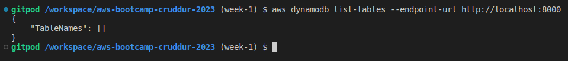
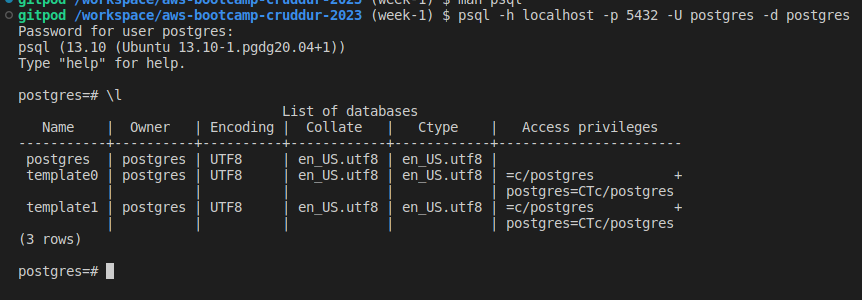

# Week 1 — App Containerization

## Required Homework

### Video Review

* Watched [How to Ask for Technical Help](https://youtu.be/tDPqmwKMP7Y) video.
* Watched [Grading Homework Summaries](https://youtu.be/FKAScachFgk) video.
* Watched [Week 1 Live Streamed Video](https://www.youtube.com/live/zJnNe5Nv4tE?feature=share) during the livestream and followed along with the tasks.
* Watched [Commit Your Code](https://youtu.be/b-idMgFFcpg) video.
* Watched [Chirag's Week 1 Spend Consideration](https://youtu.be/OAMHu1NiYoI) video.
* Watched [Ashish's Week 1 Security Consideration](https://youtu.be/OjZz4D0B-cA) video.
* Watched [Week 1 - Create the notification feature (Backend and Front)](https://youtu.be/k-_o0cCpksk) video.
  * The hardcoded confirmation code when registering an account with Cruddur is '1234'.
  * [OpenAPI Specification v3.1.0](https://spec.openapis.org/oas/v3.1.0)

### Actions

* Completed all steps during the livestream to containerize the application.
  * Reviewed notes and code in [Github - Week 1](https://github.com/omenking/aws-bootcamp-cruddur-2023/blob/week-1/journal/week1.md).
* Went through [video](https://youtu.be/k-_o0cCpksk) steps and added frontend and backend notifications functionality.
  * Documented notification endpoint for OpenAPI document.
  * Wrote Flask backend endpoint for notifications.
  * Wrote React page for notifications. 
* Went through [video](https://youtu.be/CbQNMaa6zTg) steps to set up PostgreSQL and DynamoDB Local
  * Ran DynamoDB Local container to ensure it worked
  * Ran Postgres container to ensure it worked  
  * [AWS Documentation - DynamoDB Local](https://docs.aws.amazon.com/amazondynamodb/latest/developerguide/DynamoDBLocal.DownloadingAndRunning.html)
  * [100 Days of Cloud - DynamoDB Local Challenge](https://github.com/100DaysofCloud/challenge-dynamodb-local)

  * Tested connecting to DynamoDB Local using ```aws dynamodb list-tables --endpoint-url http://localhost:8000``` which returned empty table info successfully.  I intentionally didn't add the Music tables.
 
  

  * Added steps to install PostgreSQL Client into [.gitpod.Dockerfile](../.gitpod.Dockerfile) and tested using ```psql -h localhost -p 5432 -U postgres -d postgres```
 


## Spending Considerations

## Security Considerations

## Stretch Homework

### Added steps to update Gitpod environment (incorrect)

I noticed during the prep phase that NPM complained about being out of date:


From running ```lsb_release -a``` I also found we are running Ubuntu Focal 20.04.  I ran an ```apt update && apt -y upgrade``` and noticed a lot of packages needing upgrades, so I decided to automate the updates so it would be handled anytime a new Gitpod workspace spins up.  I thought about switching the image to a newer major version like Ubuntu 22.04 Jammy Jellyfish, but apparently the default [Workspace image](https://www.gitpod.io/docs/configure/workspaces/workspace-image) is configured fairly specifically with tools and I don't want to mess too much with compatibility.  I added the following to the .gitpod.yml init section:

```
      sudo apt update && sudo apt upgrade -y
      sudo apt autoremove -y    
      npm install -g npm@latest      
```

### Automated Gitpod environment setup for local container testing (incorrect)

As part of the setup to get the app to run locally in Python, we needed to ensure all the modules in requirements.txt are installed, as well as do an npm install before building the container, so it can copy the contents of node_modules.
Added the following to the .gitpod.yml init section to automate these steps whenever a new Gitpod workspace is spun up:

```
      cd /workspace/aws-bootcamp-cruddur-2023/backend-flask
      pip3 install -r requirements.txt
      cd /workspace/aws-bootcamp-cruddur-2023/frontend-react-js
      npm i
      cd /workspace/aws-bootcamp-cruddur-2023/     
```
Credit for the idea to im__Brooke#9621 in Discord for the idea, and we figured it out together.
Basically for any future Gitpod spinups, I can go right to ```docker compose up``` when I'm ready with code changes.

### Modified Gitpod startup to create Custom Workspace Image (correct)

From some troubleshooting in the #gitpod Discord channel, we were trying to figure out why the AWS CLI utility was hanging on install.  The workaround solution I had was to group all of the init Tasks into one block, but I knew this wasn't the correct answer.  Andrew posted this message in announcements with a clue:


* I started by reviewing Andrew's [Cloud Development Environment](https://www.exampro.co/exp-cde-01) course on ExamPro.
* Tested a number of Tasks scenarios, enabled and tested Prebuilds, and set up a Custom Workspace Image using a .gitpod.Dockerfile.
* Based on what I found, we shouldn't be doing any global package/module installs using Tasks as the install won't persist if it's part of the init stage, or modifies files outside of the /workspace directory.


No seriously. I spent 10 hours on Tuesday Feb 21 researching and testing scenarios in Gitpod, writing an article up, revising, etc.

* Wrote up [an article](https://www.linuxtek.ca/2023/02/21/diving-deeper-gitpod-cloud-development-environment/) detailing everything I had found.
* Asked some questions in the Gitpod Discord, and got some feedback to fix up the article.

So now the Gitpod Workspace builds a custom image based on the referenced [.gitpod.Dockerfile](../.gitpod.Dockerfile).  There are still some commands I left in .gitpod.yml to initialize things to get ready to run a ```docker compose up```, and this runs as part of Prebuild.

Also added a bunch of extensions to automatically get added to Gitpod VS Code Browser.  Will continue to add to these:

```
vscode:
  extensions:
    - 42Crunch.vscode-openapi
    - ms-azuretools.vscode-docker
    - ms-python.python
    - hashicorp.terraform
    - redhat.ansible
    - redhat.vscode-yaml
    - amazonwebservices.aws-toolkit-vscode
```

### Cleaned up DynamoDB Location for Local Environment

Noticed a ```docker/dynamodb/shared-local-instance.db``` file getting created when I did a ```docker compose up``` with DynamoDB and PostgreSQL configured.  From researching, found [this doc](https://docs.aws.amazon.com/amazondynamodb/latest/developerguide/DynamoDBLocal.UsageNotes.html) that explains this is created if the -shareDb option is used (which we are).  I didn't want the database to get committed to the repo, so added the directory to a .gitignore file in the root repo directory.  I researched changing the local directory but as long as it only builds on test, and doesn't get committed, it's not a problem.

Rewatched the video for DynamoDB/Postgres and Andrew had done this as well (I found out afterwards).

## Publications

* [AWS Cloud Project Bootcamp – Week 1: Unofficial Homework Guide](https://www.linuxtek.ca/2023/02/18/aws-cloud-project-bootcamp-week-1-unofficial-homework-guide/)
* [Diving Deeper – Gitpod Cloud Development Environment](https://www.linuxtek.ca/2023/02/21/diving-deeper-gitpod-cloud-development-environment/)
