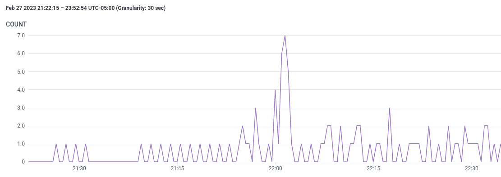
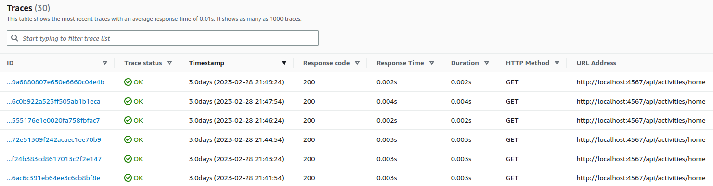
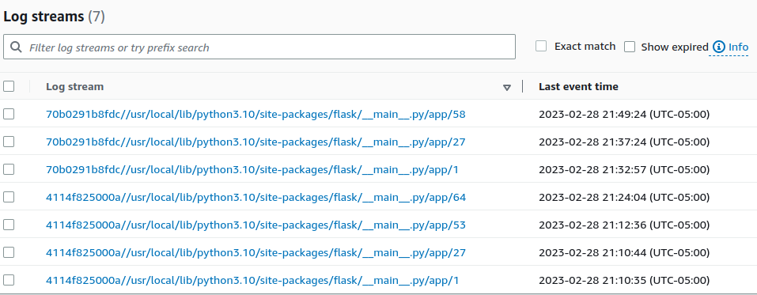
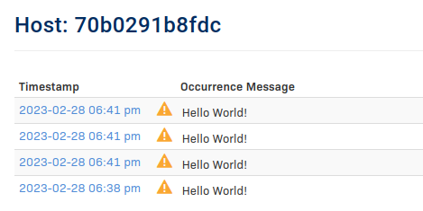
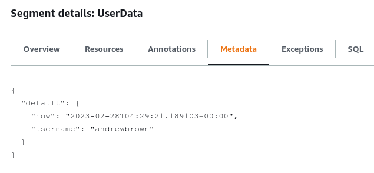
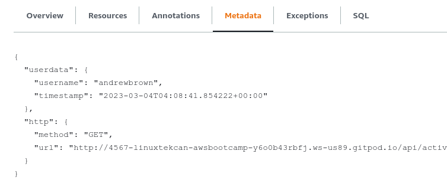

# Week 2 — Observability

## Required Homework

### Video Review
* Watched [FREE AWS Cloud Project Bootcamp - Update 2023-02-23 Video](https://youtu.be/gQxzMvk6BzM).
* Watched [Week 2 - Live Streamed Video – Honeycomb.io Setup](https://www.youtube.com/live/2GD9xCzRId4?feature=share).
* Watched [Week 2 - Instrument X-Ray Video](https://youtu.be/n2DTsuBrD_A).
* Watched [Week 2 – X-Ray Subsegments Solved Video](https://youtu.be/4SGTW0Db5y0)
* Watched [Week 2 - CloudWatch Logs Video](https://youtu.be/ipdFizZjOF4).
* Watched [Week 2 - Rollbar Video](https://youtu.be/xMBDAb5SEU4).
* Watched [Week 2 – Github Codespaces Crash Course Video](https://youtu.be/L9KKBXgKopA).

### Actions

#### Honeycomb

* Completed all steps during the livestream to set up Honeycomb distributed tracing.
* Confirmed trace data is showing up in Web UI:



#### AWS X-Ray

* Completed all steps to implement AWS X-Ray tracing
* Note:  The X-Ray Trace Groups are under **X-Ray > New Console > CloudWatch > Settings > Traces > View Settings > Groups**.
* [Github - AWS X-Ray SDK Python](https://github.com/aws/aws-xray-sdk-python)
* Able to get X-Ray Traces showing up in **CloudWatch > X-Ray Traces > Traces**:



#### AWS CloudWatch

* Completed all the steps to implement CloudWatch logs.
* Used [Watchtower](https://pypi.org/project/watchtower/) as a log handler for AWS CloudWatch.
* Used [Logging](https://docs.python.org/3/library/logging.html) to manage generating the logs.
* Left all logging for CloudWatch and X-Ray enabled in code as I'm not concerned about a slight amount of spend from log generation, if there is any.
* Confirmed log streams are able to be displayed in CloudWatch:



#### Rollbar

* [Rollbar Docs](https://docs.rollbar.com/docs/flask) for Flask do say we need to install blinker.
* [Rollbar Docs](https://docs.rollbar.com/docs/python) for Python.
* Was able to get the test "Hello World" warnings to show up in Rollbar UI:



## Spending Considerations
* Watched [Week 2 - Spend Considerations Video](https://www.youtube.com/watch?v=2W3KeqCjtDY).
* Completed Spend Quiz.

## Security Considerations
* Watched [Week 2 - Security Considerations Video](https://youtu.be/bOf4ITxAcXc).
* Completed Security Quiz.

## Stretch Homework

### Troubleshooting X-Ray Startup Message

* Had noticed during container startup, the x-ray-daemon would throw this error message:

```
aws-bootcamp-cruddur-2023-xray-daemon-1  | 2023-03-01T02:33:02Z [Error] Get instance id metadata failed: RequestError: send request failed
aws-bootcamp-cruddur-2023-xray-daemon-1  | caused by: Get "http://169.254.169.254/latest/meta-data/instance-id": context deadline exceeded (Client.Timeout exceeded while awaiting headers)
```
* From [this](https://repost.aws/questions/QUr6JJxyeLRUK5M4tadg944w/x-ray-in-ecs-get-instance-id-metadata-failed) repost.aws article, this is apparently due to the X-Ray daemon attempting to fetch EC2 telemetry data.
* Tried adjusting the flags based on [this documentation](https://docs.aws.amazon.com/xray/latest/devguide/xray-daemon-configuration.html) to disable this check, but it apparently doesn't work - the error still shows up.
* Based on the post, this failure should not affect daemon functionality in any way except a log entry during start up as you see.

### Got AWS X-Ray logging metadata properly via a subsegment in user_activities.py

* From troubleshooting after watching the video, I tried defining a segment and subsegment, and kept running into errors.
* Reviewed [this documentation](https://docs.aws.amazon.com/xray/latest/devguide/xray-sdk-python-subsegments.html) with examples repeatedly, but I couldn't get a segment definition to work.
* After working on this a while, I managed to get the data I wanted to submit to X-Ray without exception using a defined subsegment only.
* This uses the following definition to capture the user_handle and timestamp:

```
now = datetime.now(timezone.utc).astimezone()
    
with xray_recorder.in_subsegment('UserData'):
  xray_recorder.current_subsegment().put_metadata('username', user_handle)
  xray_recorder.current_subsegment().put_metadata('timestamp', now.isoformat())
```

* By defining it this way, you don't have to use begin_subsegment(), current_subsegment(), end_subsegment() functions.
* Was able to get this to output to X-Ray as metadata.  For example, going to the ```/api/activities/@andrewbrown``` endpoint would push the following to X-Ray:



* From discussions in Discord, based on [this documentation](https://docs.aws.amazon.com/xray/latest/devguide/xray-sdk-python.html), it explains that when using Django or Flask, adding the SDK middleware creates a segment for each traced request, and completes the segment when the response is sent. While the segment is open, you can use the SDK client's methods to add information to the segment and create subsegments to trace downstream calls. 

* This explains why I was only able to create a subsegment, and was constantly getting SegmentNotFoundException errors when attempting to create a segment while one was already defined via the middleware.

### Improved AWS X-Ray Tracing Subsegment Metadata

* Went through the [article](https://olley.hashnode.dev/aws-free-cloud-bootcamp-instrumenting-aws-x-ray-subsegments) Olley wrote describing the issues with X-Ray segments/subsegments, and the [video](https://youtu.be/4SGTW0Db5y0) Andrew published on it.

* I had previously adapted my implementation of X-Ray in a different way so I didn't have to explicitly begin and end the subsegment, so I could not use the exact same method Olley did.
* Modified segment/subsegment names to match function name user_activities.
* Adjusted app.py code for X-Ray to capture the user_activities data, so I could pull the http url and method.
* Adjusted user_activities.py code to use "user_activities" as the subsegment, and added in the additional metadata.
* Renamed the metadata groups so they are grouped better:

```
with xray_recorder.in_subsegment('user_activities'):
xray_recorder.current_subsegment().put_metadata('username', user_handle,'userdata')
xray_recorder.current_subsegment().put_metadata('timestamp', now.isoformat(),'userdata')
xray_recorder.current_subsegment().put_metadata('method',self.request.method, 'http')
xray_recorder.current_subsegment().put_metadata('url', self.request.url, 'http')
```

Now when I access, for example, /api/activities/@andrewbrown, the trace includes this data:



### Attended Rollbar Project Configuration Best Practices Webinar

* [Video Recording](https://youtu.be/if79J5qJyo8)
* Webcast went over a number of helpful best practices when setting up Rollbar.
* Went over implementing Rollbar error handling in Python as well as other languages like Javascript.

## Publications

* [AWS Cloud Project Bootcamp – Week 2: Unofficial Homework Guide](https://www.linuxtek.ca/2023/02/26/aws-cloud-project-bootcamp-week-2-unofficial-homework-guide/)