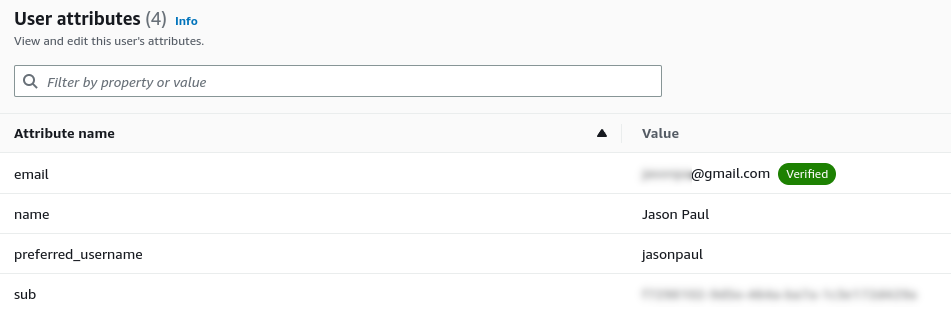

# Week 3 — Decentralized Authentication

## Required Homework

### Video Review

* Watched: [Week 3 – Live Streamed Video – Decentralized Authentication](https://www.youtube.com/live/9obl7rVgzJw)
* Watched: [Week 3 - Cognito Custom Pages](https://youtu.be/T4X4yIzejTc)
* Watched: [Week 3 - Exploring JWTs](https://youtu.be/nJjbI4BbasU)

### Actions

#### Live Stream Video Tasks - Set up Cognito User Pool

* Followed livestream video to implement custom sign-in.  Got to the point where I got the same error:

```
Cannot read properties of null (reading 'accessToken')
```

#### Implement Cognito Custom Sign-In Page

* Ran the following command on my user created in Cognito to force a permanent password:

```
aws cognito-idp admin-set-user-password \
  --user-pool-id <your-user-pool-id> \
  --username <username> \
  --password <password> \
  --permanent
```
* Updated Sign-In Page
* Now able to sign in properly.
* Recreated my user pool multiple times to fix the fields for email, preferred_username, and name.
* Updated values in docker-compose.yml and restarted - now able to sign up and log in.
* Updated Recovery Page with onsubmit send/confirm code.
* Tested password recovery - it does send an email with a verification code.
* Confirmed I am able to register and log in, and my user is created and valid in Cognito:



#### Cognito - Implement Custom Sign-Up Page

* Updated SignupPage.js with modified code.
* Adjusted setErrors to remove Cognito references.

#### Cognito - Implement Custom Confirmation Page

* Updated ConfirmationPage.js with modified code.
* Adjusted setErrors to remove Cognito references.

#### Cognito - Implement Custom Recovery Page

* Updated RecoveryPage.js with modified code.
* Adjusted setErrors to remove Cognito references.

#### Exploring JWTs

* Watched video on exploring JWTs

## Stretch Homework

### Dev Containers


* A number of students were mentioning in Discord that they were running out of Gitpod credits, and spending time converting their configuration to run on Github Codespaces.
* The problem with this, is that the configuration files are completely different, and many of the URLs need to be changed in order to function.
* One of the main reasons we were advised not to use our local computer for the bootcamp was all of the different hardware and software configurations would be impossible to troubleshoot if issues occurred.
* It was important for us all to have a similar/consistent development environment, with the same dependencies and software.
* One of the other reasons was so that when reviewing progress for each week, Andrew could just launch the repository in Gitpod to check on things.
* Dev Containers solve all of these problems.  It provides a Dev Environment which can be defined in code using a devcontainer.json file, and a Dockerfile.
* It allows to create a workspace image with all of the dependencies and software built in, to prevent having to install all of the software every time it is launched.
* Developed a configuration that was based on the Gitpod image, added specific dependencies for npm, pip, postgres, etc.
* Pulled in all of the environment variables from the OS to the container
* Built and tested on Linux and Windows, provided steps for Windows 11 in the article written with all the details.
* Multiple students were able to test this and get it working successfully.
* Took approximately 12 hours over 2 days to research, develop, test, and document.
* Bonus: [Github Codespaces uses Dev Containers](https://docs.github.com/en/codespaces/setting-up-your-project-for-codespaces/adding-a-dev-container-configuration/introduction-to-dev-containers) - the developed configuration may be compatible with Github Codespaces.

## Publications
* [AWS Cloud Project Bootcamp – Week 3: Unofficial Homework Guide](https://www.linuxtek.ca/2023/03/07/aws-cloud-project-bootcamp-week-3-unofficial-homework-guide/)
* [AWS Cloud Project Bootcamp – Solving The CDE Problem](https://www.linuxtek.ca/2023/03/10/aws-cloud-project-bootcamp-solving-the-cde-problem/)

